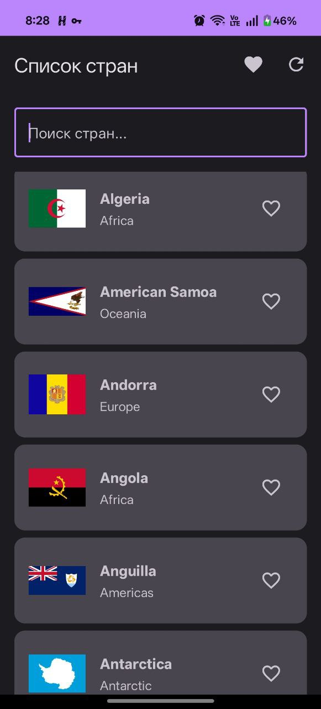
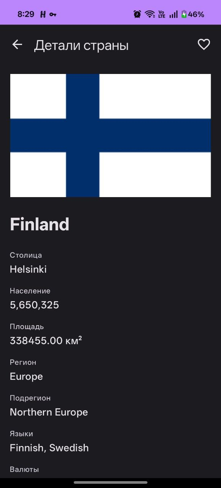
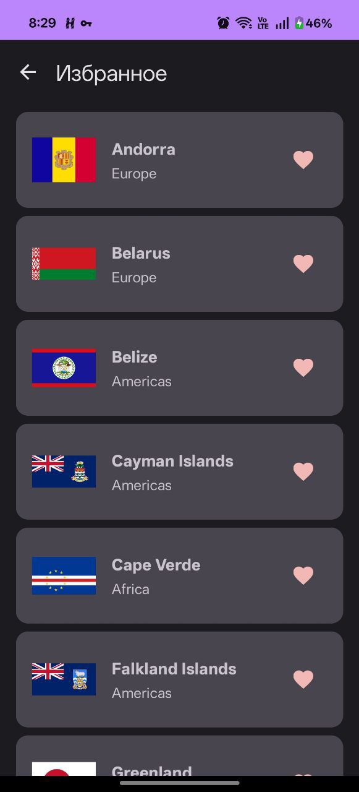

# Countries Explorer (Android)

## Описание
Android-приложение для просмотра стран мира. REST Countries API.
Экран избранного с сохранением в Room (данные переживают перезапуск приложения).

## Стек и архитектура
- Kotlin + Jetpack Compose + Coroutines
- Retrofit + OkHttp + Gson
- DI: Hilt
- БД: Room (таблица favorites)
- Архитектура: data (API, local) - Repository - ViewModel - UI

## API (REST Countries)
- Base URL: https://restcountries.com/
- List: GET /v3.1/region/{region} (Africa, Americas, Asia, Europe, Oceania, Antarctic)
- Search: GET /v3.1/name/{name}
- Detail: GET /v3.1/alpha/{code}
- API ключ не требуется

## Room
**Таблица:** `favorites` (code, name)
- Избранное сохраняется между перезапусками приложения
- Проверка: добавить страну в избранное - закрыть приложение - запустить - избранное на месте

## Сборка (JDK 17)
Windows: `gradlew.bat assembleDebug`

## Скриншоты

