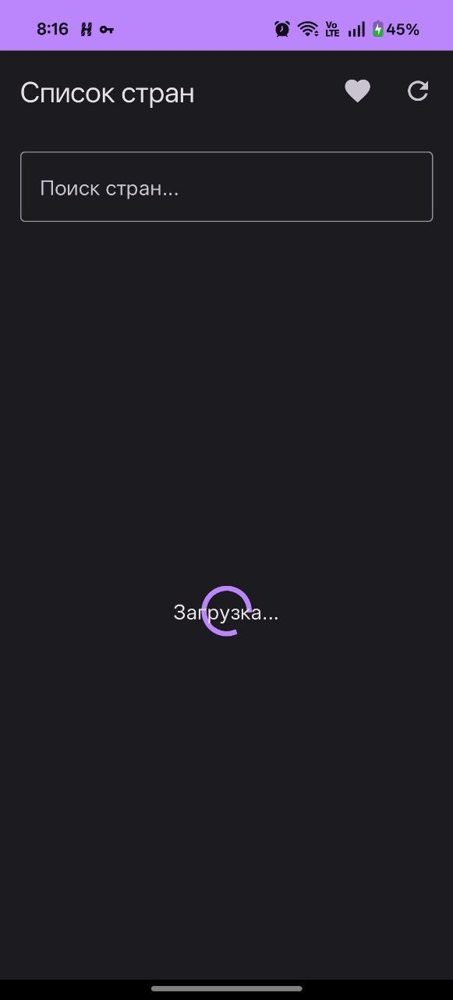
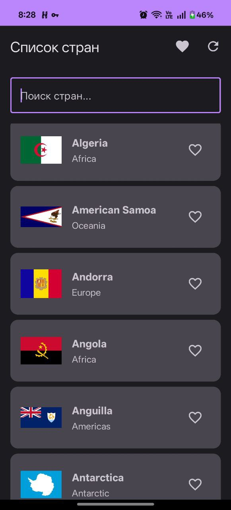
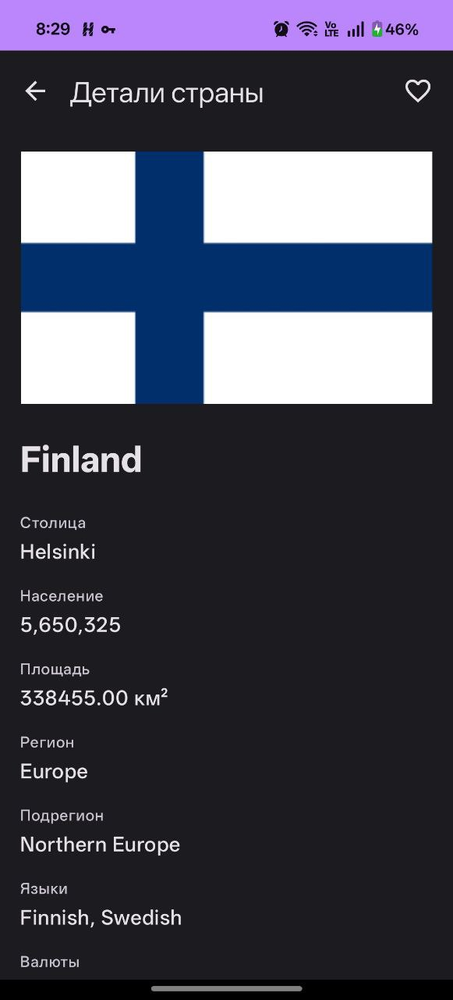
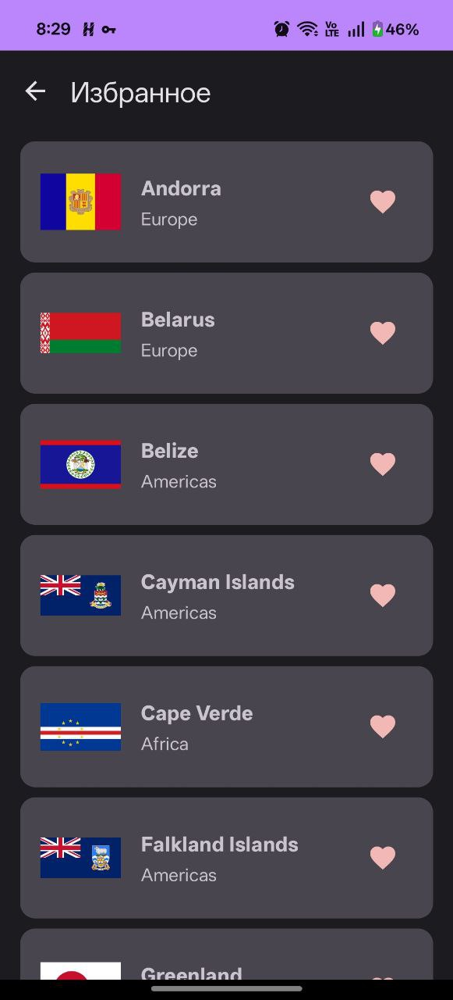

# Countries Explorer (Android)

**Автор:** Грибовский Илья Игоревич

## Описание

**Countries Explorer** — Android-приложение для просмотра стран мира через **REST Countries API**. Экран избранного с **Room**: данные переживают перезапуск.

- **Room:** таблица `favorites` (`code`, `name`, `region`, `flagUrl`). Тап по сердцу — запись в БД, снятие избранного — удаление. Экран избранного читает Room через **Flow**.
- **Проверка:** добавить страну в избранное → закрыть приложение → снова открыть — избранное на месте.

## Стек и архитектура

- Kotlin + Jetpack Compose + Coroutines
- Retrofit + OkHttp + Gson
- DI: Hilt
- БД: Room (таблица favorites)
- Архитектура: data (API, local) → Repository → ViewModel → UI

## API (REST Countries)

- Base URL: https://api.restcountries.com/
- List: GET /countries/v5/region/{region}
- Search: GET /countries/v5/name?q={name}
- Detail: GET /countries/v5/code?q={code}
- API ключ: добавить `REST_COUNTRIES_API_KEY` в `local.properties` (см. https://restcountries.com/sign-up)

## ДЗ 5

Юнит- и интеграционные тесты, Room, навигация Compose, обработка ошибок без маскировки под `Empty`, детерминированные тесты ViewModel/репозитория.

### Юнит-тесты

`CountriesListViewModelTest` (5), `CountryDetailViewModelTest` (3), `FavoritesSharedViewModelTest` (2), `CountriesRepositoryTest` (6), `FavoriteEntityTest` (1), `CountryCodeHelperTest` (2).

### Интеграция

`MainActivityComposeTest` (1), `NavigationComposeInstrumentedTest` (3), `FavoritesRoomInstrumentedTest` (2).

### Запуск тестов

```bat
.\gradlew.bat :app:testDebugUnitTest
.\gradlew.bat :app:connectedDebugAndroidTest
```

## Сборка (JDK 17)

```bat
.\gradlew.bat assembleDebug
```

## Скриншоты







